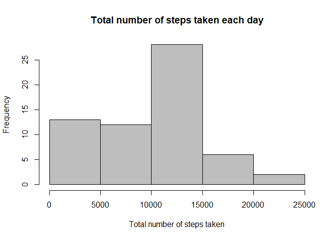

This document is a part of the first course project in Reproducible Research course from JHU Data Science specialization on Coursera.

## Loading and preprocessing the data

First, we need to remember to set our working directory to a folder with the downloaded data. Then we can unzip it:

```r
fileZipped <- "./activity.zip"
fileUnzipped <- "./activity.csv"

if (!file.exists(fileUnzipped)) { 
    unzip(fileZipped) 
}
```

Now we can load the data into a data frame. We should make sure, though, that the dates are in a correct format:

```r
activity <- read.csv("activity.csv")
activity$date <- as.Date(activity$date)
```

We will be reshapig this data frame while solving the next tasks. For now, we can assume that the data is in a format which is suitable for our analysis.


## What is mean total number of steps taken per day?

To answer the given question, we need to aggregate the data to daily grain. There are many ways to do this - here the dplyr package is used:


```r
library(dplyr)
```


```r
steps_per_day <- activity %>%
    group_by(date) %>%
    summarize(steps_sum = sum(steps, na.rm = TRUE))
```

The steps_per_day data frame contains two columns only: the date and the sum of the steps taken on that day. For now, the missing values in the dataset were simply ignored.

The histogram of the total number of steps taken each day can be constructed this way:


```r
hist(steps_per_day$steps_sum, col = "grey",
     main = "Total number of steps taken each day",
     xlab = "Total number of steps taken")
```

<!-- -->

We can see that the user most often took 10.000-15.000 steps per day.

The mean number of total daily steps is:

```r
mean(steps_per_day$steps_sum)
```

```
## [1] 9354.23
```

...while its median is equal to:

```r
median(steps_per_day$steps_sum)
```

```
## [1] 10395
```

## What is the average daily activity pattern?

We'll make an aggregation similar to the one performed in the previous question, but this time let's produce a table containing an interval number and the average number of steps taken during that interval across all days. Again, we'll use the dplyr package and ignore the missing values:


```r
steps_per_interval <- activity %>%
    group_by(interval) %>%
    summarize(steps_avg = mean(steps, na.rm = TRUE))
```

Using the steps_per_interval data frame, we can plot the average daily steps pattern:


```r
plot(steps_per_interval$interval, steps_per_interval$steps_avg, type = "l",
     main = "Average daily activity pattern",
     xlab = "5-minute interval", ylab = "Average number of steps taken")
```

<!-- -->

The maximum average number of steps is observed in the following interval:

```r
steps_per_interval[which.max(steps_per_interval$steps_avg), "interval"]
```

```
## # A tibble: 1 x 1
##   interval
##      <int>
## 1      835
```

## Imputing missing values

To devise a good strategy for imputing missing values, we should answer a basic question - how many missing values are there in the dataset?

```r
sum(is.na(activity$steps))
```

```
## [1] 2304
```

This means that the following share of observations is missing:

```r
paste0(round(sum(is.na(activity$steps))/nrow(activity)*100, 2), "%")
```

```
## [1] "13.11%"
```

This seems to be a significant number, so we shouldn't ignore them.

We'll fill the missing data with the mean number of steps for a given interval. It seems more appropriate than using daily means, because there are days with missing data only. What is more, by looking at one of the previous charts we can safely assume that the number of steps is heavily influenced by the time of a day.

We're going to use dplyr once more and join the original activity data frame to the steps_per_interval data frame, which we produced before. Then we'll be able to replace the missing number of steps only with the average number of steps for the interval.

```r
activity_imputed <- left_join(activity, steps_per_interval, by = "interval")
activity_imputed <- activity_imputed %>%
    mutate(steps_imputed = ifelse(is.na(steps), steps_avg, steps)) %>%
    select(steps_imputed, date, interval)
```

Now we can examine how different histogram of the number of steps is after we imputed the NA's:

```r
steps_imputed_per_day <- activity_imputed %>%
    group_by(date) %>%
    summarize(steps_imputed_sum = sum(steps_imputed))

hist(steps_imputed_per_day$steps_imputed_sum, col = "grey",
     main = "Total number of steps taken each day",
     xlab = "Total number of steps taken")
```

<!-- -->

The difference doesn't seem to be huge. We can see that the middle bar has risen significantly, which is something that we could have expected as we filled the missing data with average numbers.

What about the new mean and median number of daily steps?

```r
mean(steps_imputed_per_day$steps_imputed_sum)
```

```
## [1] 10766.19
```

```r
median(steps_imputed_per_day$steps_imputed_sum)
```

```
## [1] 10766.19
```

They both increased. What is more interesting, they are equal now, so the distribution of daily steps became symmetric.

## Are there differences in activity patterns between weekdays and weekends?

First, we need to create a new variable that will indicate whether a given date is part of a weekend or a weekday. Then we'll group the data by this new variable and intervals. 

```r
activity_imputed_aggregated <- activity_imputed %>%
    mutate(day_type = ifelse(weekdays(date) == "sobota" 
                             | weekdays(date) == "niedziela",
                             "weekend",
                             "weekday")) %>%
    group_by(interval, day_type) %>%
    summarise(steps_imputed_avg = mean(steps_imputed))
```

Now we can create a plot that shows differences between weekdays and weekends. To do this, we'll use the ggplot2 library.

```r
library(ggplot2)
```

```r
ggplot(activity_imputed_aggregated, aes(interval, steps_imputed_avg)) + geom_line() + facet_grid(. ~ day_type) + labs(title = "Activity patterns on weekdays and weekends", x = "5-minute interval", y = "Average number of steps taken")
```

<!-- -->

Thanks to the chart, we can tell that there are obvious differences between activity patterns on weekdays and weekends. The average number of steps per interval is more evenly distributed, while on weekdays we can observe a sudden increase around interval no. 900.
